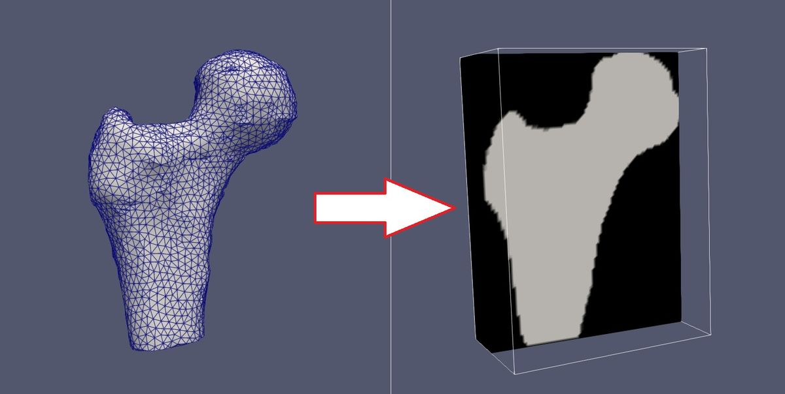

# Meshes2Labels
The `m2l` command-line tool converts 3D surface meshes to a 3D labelled volumetric image. Multiple meshes can be jointly converted and "painted" with different label values in the output image.

This type of conversion referred to as _voxelization_ or _rasterization_, is the opposite of mesh reconstruction introduced by the seminal _Marching Cubes_ approach.

This conversion is very useful when a mesh can be linked with a 3D medical image, for example in the context of image segmentation. For instance, a 3D mesh is obtained by an external process and you would like to convert it into an image, for e.g. masking or visualization purposes.

## Building

Follow instructions [here](building.md).

## Supported formats
* **Input mesh**: `vtk polydata`, `stl`, `obj` and `ply`. Make sure that your meshes are triangular. Also it is better to ensure than they are "clean", i.e. not presenting weird or isolated triangles, etc. Tetrahedral meshes in vtkUnstructuredGrid format are also supported, the app will extract the surface as a vtlPolyData file.
* **Input reference and output label image**: any image format supported by the [ITK](https://itk.org/) library. Input reference images can have any type of voxel types, while output label images are saved in `unsigned short` (default) and `unsigned char` (using `--uchar` option) types.

## Principles and examples

The main principles with different examples are found [here](examples.md). All options can be spotted in a glance using the command line command: `m2l -h`.

## Licence

This source code is available under the **GPLv3 licence** to comply with the use of Sariel Har-Peled's _gdiam_ code to compute oriented bounding boxes.

## Known limitations

The code could be cleaner in terms of best practices, use modern C++ and VTK features (e.g. use of smart pointers), as well as addition of more comments. The current release mainly focuses on making the code available to the scientific community.

The project has only be tested on Windows (Visual Studio 2017) and Ubuntu linux gcc 9.4, but it should compile in other platforms as all its components are cross-platform.
