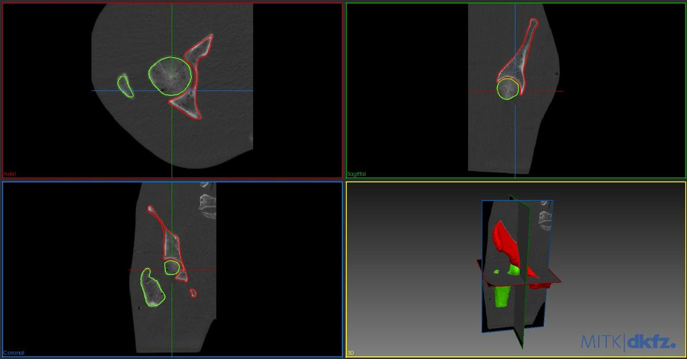
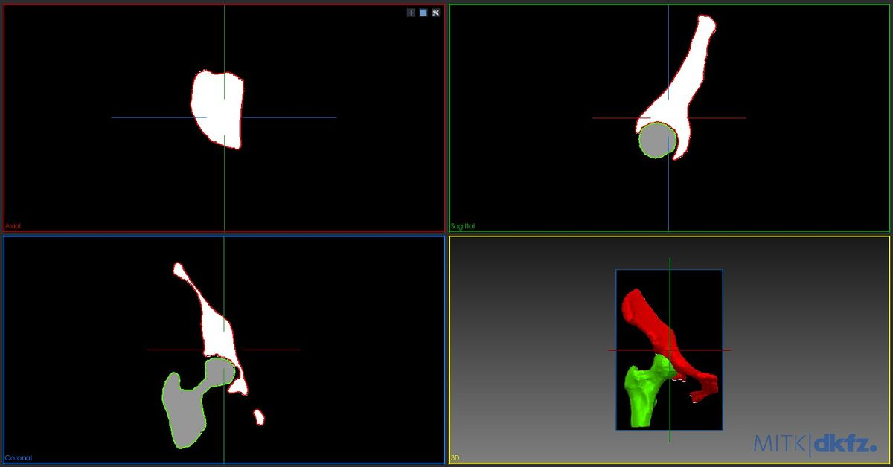
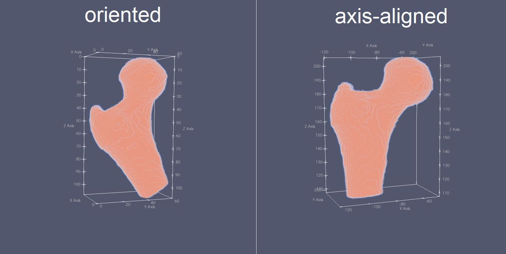

# Main concepts and examples

## Labeling

`m2l` program takes as input a single or a series of meshes and converts them to a 3D volumetric labelled image by using the principle of voxelization or rasterization. The label of a mesh indicates the intensity value of any voxel covered by the mesh and its interior. 

When a single mesh is converted, the label is specified using the `-l` option:

    m2l -i mesh.obj -l 255 ...

When several meshes are converted, the multi-conversion option `-m` is set and a configuration file is provided instead of a mesh filename:

    m2l -i config.txt -m ...

The syntax of the config file is pretty straightforward:

    mesh_filename_1 label_value_1
    mesh_filename_2 label_value_2
    etc.

Accepted label values depend on the output image voxel type. By default the `unsigned short` type is chosen, but the `unsigned char` type can be also used (`--uchar` option) to get a more compact image. In case of multiple mesh conversion, this voxel type limits the number of meshes that can be uniquely represented in a same label image.

The background value (=absence of mesh) is 0.

## Output image characteristics 

The output image is specified using the `-o` option.

The characteristics of the output image are its **size**, **spacing** (i.e. voxel size in physical units) and **origin** (please refer to the excellent documentation of the `ITK` library regarding these characteristics).

These characteristics can be controlled in different ways.

### manual characteristics 
The user can specify these characteristics using the `--size`, `--spacing` and `--origin` options using the syntax:

    --size dimx,dimy,dimz (in number of voxels along each direction X, Y and Z)
    --spacing sx,sy,sz (in physical units)
    --origin ox,oy,oz (in physical units)

Example:

    m2l -i mesh.obj -l 200 -o label_image.mga --uchar -- size 512,512,200 --origin 0,0,0 --spacing 1,1,1

### Reference image
A reference image can be provided using the `--ref` option to get the output image characteristics. The user can overwrite any of these characteristics using the manual options.

    m2l -i mesh.obj -l 200 -o label_image.mga --uchar -r reference_image.mha

This option is very useful when you mesh is related to a medical image, and you want to rasterize to match the image characteristics. For instance the following figure depicts meshes for a proximal femur and a hip bone reconstructed from a CT image:

Using the `m2l` application the meshes are converted to a label image with same characteristics as the CT image:

### Bounding box 
A bounding box can be used to automatically define the extents of the output image. In this case, the user just has to manually provide the output spacing (which will affect the image size).

Two different ways can be used to compute the bounding boxes as shown in the next image in which a mesh of a proximal femur bone is converted to a labelled image whose outline is depicted:
* **axis-aligned** (`--fit` option): a bounding box is computed along the X, Y and Z directions that contains the mesh(es).
* **oriented** (`--ofit` option): an oriented bounding is computed to enclose as tightly as possible the mesh. The resulting coordinate system (CS) of the labelled image is not anymore aligned with the CS of the mesh. Transformation files to move from on CS to another are produced as a result.

Any bounding box can be enlarged with a **padding** value specified in **physical units** (`--padding` option).

### Other options

**update mode** Sometimes you want to split the rasterization process is separate steps for each mesh instead of relying on a configuration file. In that you can switch to the update mode using the `-u` option. In this case, the application will load the image specified using `--ref` option and will paint the labels in this image without clearing its contents. 

**Stencil** By default, the VTK stencil approach is used to rasterize meshes to image. A previous approach using surface painting and interior filling is also available by using the `--noVtkStencil` option. This approach slightly overestimates the labeled mesh boundaries and requires closed meshes, so the VTK approach should be preferred. However, in case where the stencil approach fails, you may consider using this alternative approach.

**OBBTree** In case where your meshes are a large number of points or you have several meshes, you may want to speed up the process using the `--useOBBTree` option.

## Examples

The folder `examples` contains shell scripts to showcase different options of the application based on data shared in the `data` folder. We advise using the excellent [MITK workbnech viewer](https://www.mitk.org/wiki/Downloads) to display the 3D images along side the meshes to better appreciate the different options previously covered.